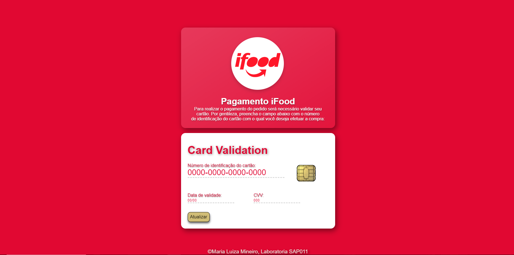

# Card Validation

## Índice

* [1. Descrição do Projeto](#1-descrição-do-projeto)
* [2. Status do Projeto](#2-status-do-projeto)
* [3. Funcionalidades e Demonstração da Aplicação](#3-funcionalidades-e-demonstração-da-aolicação)
* [4. Acesso ao Projeto](#4-acesso-ao-projeto)
* [5. Tecnologias utilizadas](#5-tecnologias-utilizadas)

***

## 1. Descrição do Projeto

A interface deste projeto foi realizada pensando em usuários do iFood que, para finalizar seu pedido, devem inserir e validar seu cartão com a finalidade de concluir a compra. A validação é feita a partir do [algoritmo de Luhn](https://en.wikipedia.org/wiki/Luhn_algorithm), também
chamado de módulo 10, o qual é um método de soma de verificação, usado para validar
números de identificação, como o IMEI de telefones celulares, cartões de crédito
etc.

Esse algoritmo é simples. Obtemos o inverso do número a ser verificado (que
contém apenas dígitos [0-9]); todos os números que ocupam uma posição par devem
ser multiplicados por dois; se esse número for maior ou igual a 10, devemos
adicionar os dígitos do resultado; o número a verificar será válido se a soma de
seus dígitos finais for um múltiplo de 10.

## 2. Status do Projeto

O projeto está concluído e com interface acessível e interativa. **Finalizado.**

## 3. Funcionalidades e Demonstração da Aplicação

Para validar o cartão os usuários devem preencher o campo "Número de identificação do cartão" e imediatamente visualizarão uma atualização no formulário acima, o qual apresentará o número digitado mascarado com excessão dos últimos 4 dígitos e o resultado da validação, informando se o cartão informado é válido ou não.

As aplicações são:
* Inserir o número do cartão a ser validado (apenas caracteres numéricos).
* Mostrar o resultado da validação.
* Ocultar todos os dígitos do número do cartão, excetuando os últimos 4 caracteres.
* Não permitir a submissão de um campo vazio.

## 4. Acesso ao Projeto

Para acessar a página e realizar validação visite este link: https://malumineiro.github.io/SAP011-card-validation/

## 5. Tecnologias utilizadas

**HTML, CSS, Web APIs e JavaScript.**
